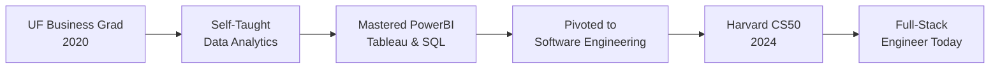

# Hey, I'm Dayle Cortes 👋

### Full-Stack Software Engineer | Next.js • MERN • PERN Specialist

> 🚀 I build production-ready web applications that scale. From business analytics to full-stack development, my journey proves one thing: **anything unfamiliar becomes easy once you commit to learning it repeatedly.**

[](https://daylecortes.com)
[](https://www.linkedin.com/in/dayle-cortes)
[](mailto:daylecortes1997@gmail.com)

---

## 🎯 What I Do

I build **real-time, scalable web applications** using modern JavaScript frameworks. My skills span the full stack—from architecting databases to crafting pixel-perfect UIs—and I'm eager to apply them to solve real-world problems.

**What Excites Me:** Real-time systems, authentication architecture, AI/ML integration, and building products that users love

**Beyond Code:** Exploring AI & Agentic AI trends, staying fit, and experimenting in the kitchen 👨‍🍳

---

## 🛠️ Tech Stack

**Frontend**

```
React • Next.js 14 • TypeScript • JavaScript (ES6+) • Tailwind CSS
```

**Backend**

```
Node.js • Express.js • RESTful APIs • Prisma ORM • Mongoose • Python
```

**Database & Auth**

```
PostgreSQL • MongoDB • NextAuth.js • OAuth 2.0 • JWT • bcrypt
```

**DevOps & Tools**

```
Docker • Vercel • Fly.io • Git • Postman • CI/CD • Cloudinary • Pusher
```

**Data Analytics** _(Previous Experience)_

```
Tableau • PowerBI • Alteryx • IBM Cognos • SQL
```

---

## 🚀 Featured Projects

### 🗨️ [Dex Real-Time Messenger](https://dex-messenger.vercel.app)

**Next.js 14 • TypeScript • MongoDB • Pusher • NextAuth**

- ⚡ Real-time messaging with instant read receipts & presence indicators
- 🔐 Multi-provider authentication (Google, GitHub, Credentials)
- 👥 Group chat with file uploads via Cloudinary CDN
- 📝 Comprehensive JSDoc documentation

### 🎬 [Dex Real-Time Streaming](https://dex-streaming.vercel.app)

**Next.js 13 • TypeScript • MongoDB • Prisma**

- 🎯 Netflix-inspired architecture with multi-profile management
- 🔒 Secure JWT sessions with NextAuth.js
- ⚡ Server-side rendering for optimal performance
- 🎨 SWR for server state + Zustand for local state

### 📝 [Dex Note-Taking App](https://dex-note-taking-app.vercel.app)

**MERN Stack • Redis Rate Limiting**

- 🔥 Full CRUD with RESTful API architecture
- 🛡️ Upstash Redis rate limiting for security
- 📱 Mobile-first responsive design
- 🚀 Production deployment: Fly.io + Vercel

### 🛒 [Dex Product Store](https://dex-product-store.vercel.app)

**PERN Stack • Docker • Neon PostgreSQL**

- 💳 E-commerce product management system
- 🔐 Security: Helmet, CORS, ArcJet rate-limiting
- 🐳 Dockerized backend deployment
- 🎨 Zustand state management

---

## 📈 My Growth Journey



**From Zero to Production:**

- 🎓 Started with zero coding knowledge in 2020
- 📊 Mastered data analytics tools (PowerBI, Tableau, Alteryx)
- 💻 Self-taught HTML, CSS, JavaScript, Python, React
- 🎯 Completed Harvard CS50 (2024) for CS fundamentals
- 🚀 Now building production-ready full-stack applications

---

## 💼 Why Hire Me?

✅ **Production-Ready Code:** Every project is deployed, documented, and built with best practices  
✅ **Remote Work Expert:** Successfully working remotely since 2020 with proven productivity  
✅ **Fast Learner:** Transitioned from business analytics to full-stack engineering through self-teaching  
✅ **Growth Mindset:** Continuously adapting to new technologies and industry standards  
✅ **Communication:** Fluent in English & Visayan/Tagalog, basic Spanish

---

## 📊 GitHub Stats


---

## 🎓 Education & Certifications

🎓 **University of Florida** - BS Business Administration, Information Systems (2020)  
🏆 **Harvard CS50** - Introduction to Computer Science (2024)  
💼 **Remote Work Experience** - FIS Global (2020)

---

## 🤝 Let's Connect!

I'm actively seeking **remote full-time positions** where I can contribute to innovative projects and grow with a dynamic team. If you're looking for a developer who brings:

- 🔥 Technical expertise in modern full-stack development
- 🚀 Proven ability to ship production-ready applications
- 📈 A growth mindset and passion for continuous learning
- 🌍 Remote work experience and strong communication skills

**Let's build something amazing together!**

📧 **Email:** daylecortes1997@gmail.com  
🌐 **Portfolio:** [daylecortes.com](https://daylecortes.com)  
💼 **LinkedIn:** [linkedin.com/in/dayle-cortes](https://www.linkedin.com/in/dayle-cortes)

---

<div align="center">
  <i>"Anything unfamiliar becomes easy once you commit to learning it repeatedly."</i>
  <br><br>
  
</div>
